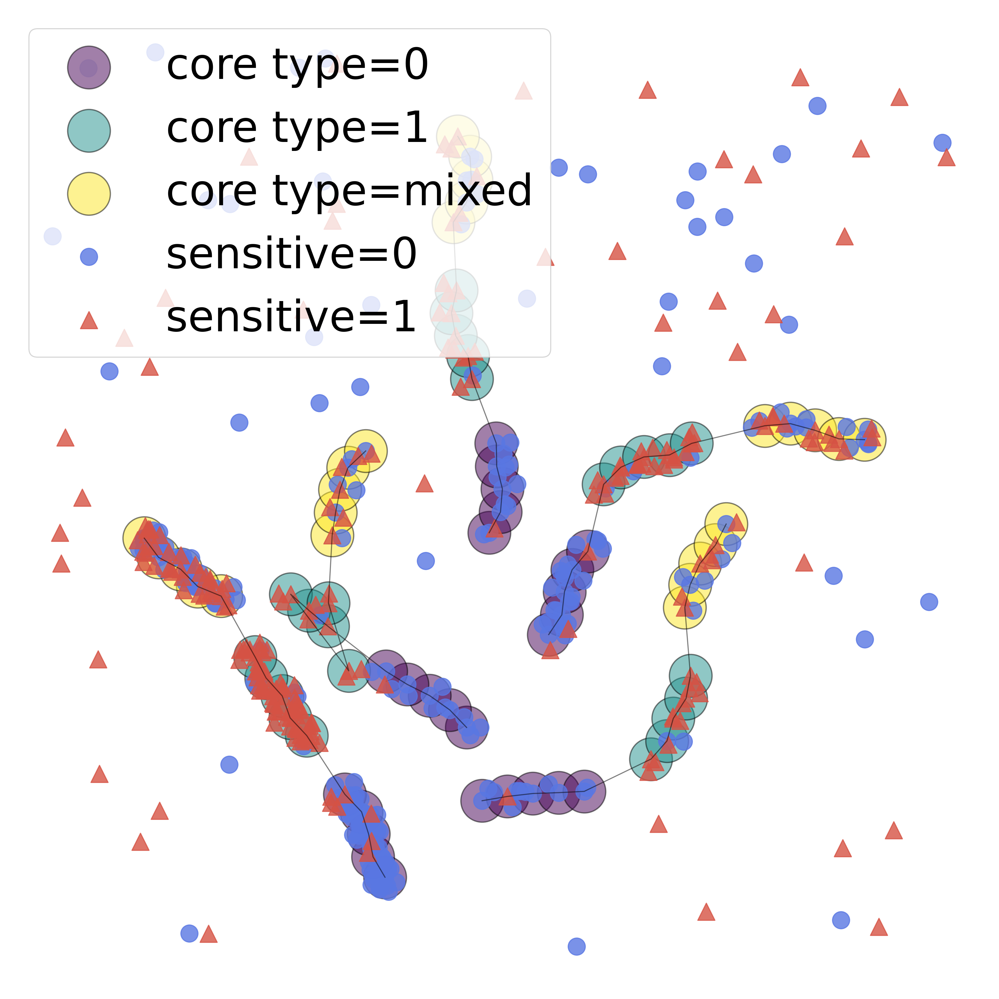
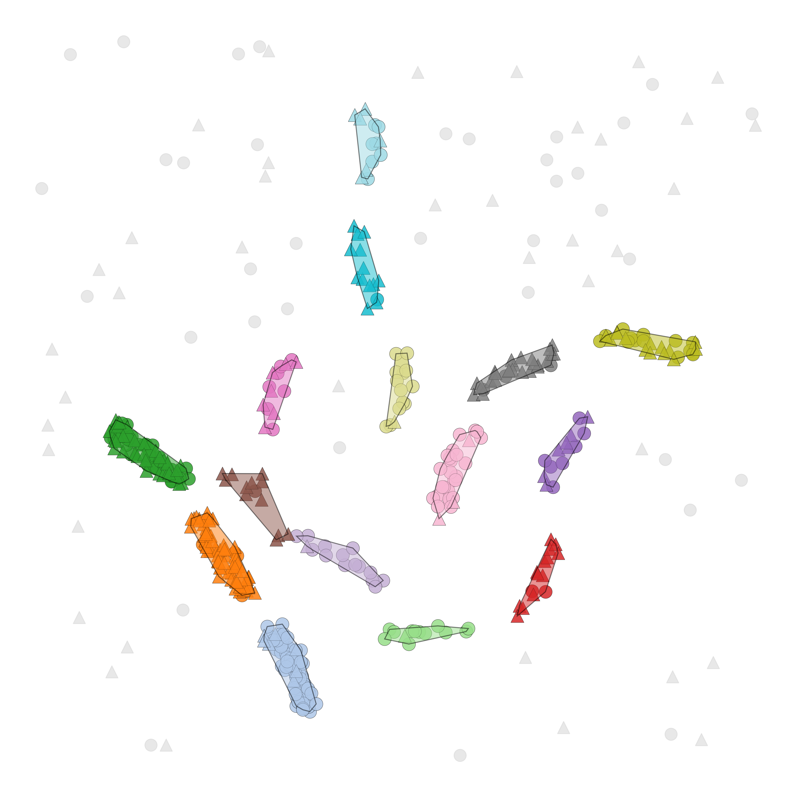

# Are We Evaluating Fair Clustering Fairly? Benchmarks, Protocols and Data Generation for Non-Convex Fair Clustering

Fair clustering evaluation currently lacks standardized benchmarks and protocols. Existing evaluations rely heavily on a small number of datasets originally developed for supervised learning, resulting in inconsistent preprocessing and incomparable experimental settings. This repository provides a benchmark study of fair clustering evaluation, including a fairness-aware model selection protocol and a synthetic data generator for density-based clustering scenarios.
---

# Artifact Overview

This repository provides:

- python implementations of evaluated clustering methods and metrics
- UCI benchmark experiment scripts
- the DEBRIS synthetic data generator
- scripts to reproduce paper figures and tables

---

# Repository Structure

```
data_uci/       Datasets from the UCI repository (see data_uci/README.md)
experiments/    Scripts for reproducing experiments
figures/        Figure generation scripts
results/        Generated experiment outputs
src/            Core implementation
```

---

# Installation
The experiments were tested and developed using Python 3.9. \
Clone the repository:
```bash
git clone https://github.com/rainer-w/fair-clustering-evaluation.git
cd fair-clustering-evaluation
```
Create a virtual environment for the project:
```bash
python -m venv venv
```
On Linux/macOS: 
```bash
source venv/bin/activate
```
on Windows: 
```bash
venv\Scripts\activate
```
When the environment is activated, install the required dependencies:
```bash
pip install -r requirements.txt
```
After installation, you may verify the setup by running the DEBRIS example: 
```bash
python -m figures.generate_debris_example
```
---
## Quick Start / Example Usage: DEBRIS Generator

<p align="center">
  
  
  
</p>

<p align="center">
<sub>
Example DEBRIS output: cores generated by a random walk, density-based ground truth, and fair cluster assignments.
</sub>
</p>

DEBRIS can be used to generate synthetic density-based clusters with controllable sensitive attribute distributions.

The example dataset above was generated with these parameters: 

| Parameter | Value |
|-----------|-------|
| Number of samples | 1000 |
| Number of clusters | 5 |
| Dimensionality | 2 |
| Sensitive attribute groups | 2 |
| Noise ratio | 0.15 |
| Number of cores | 15 per cluster |
| Random seed | 36 |
| Sensitive attribute distribution | `[[0.9, 0.1], [0.1, 0.9]]` |
| Cluster ratios (densities) | [0.5, 0.1, 0.1, 0.2, 0.1] |

Unlike standard Gaussian synthetic benchmarks, DEBRIS generates non-convex density structures where clustering quality and fairness can be evaluated under more realistic geometric assumptions.
---

# Reproducing the Paper

All experiments should be executed from the repository root.

For example, to reproduce the UCI benchmark experiments:

```bash
python -m experiments.realworld.run_all_uci
```
The UCI datasets are not included due to their size. To reproduce the experiments, download and organize them according to the instructions in [data_uci/README.md](data_uci/README.md).
Generated outputs, including experiment results, CSV files, and generated figures, are stored in:

```text
results/
├── debris/
├── synthetic/
└── uci/
```

Since the experiments using DEBRIS are extensive, averaging the results of all evaluated algorithms over five different seeds per dataset, it is recommended to run them separately/ in parallel due to runtime. \
For example, to produce the results for varying the imbalance within the subgroups of clusters: 
```bash
python -m experiments.debris.7_Varying_Imbalance 
```
But, you may run all experiments at once using: 
```bash
python -m experiments.debris.run_all_debris
```
The results for each individual seed of a given experiment N will be stored in a subfolder, and the averaged values directly in their correspond folder results/debris/ExperimentN. 

Additional figures from the paper can then be generated using the scripts in:

```
figures/
```
# Paper Reproduction Guide

| Paper Component | Repository Location |
|---|---|
| UCI experiments | `experiments/realworld/` |
| DEBRIS experiments | `experiments/debris/` |
| Other synthetic experiments | `experiments/synthetic/` |
| DEBRIS generator | `src/generators/debris.py` |
| Figure generation | `figures/` |
| Evaluation metrics | `src/evaluation/` |


---

# DEBRIS Synthetic Data Generator

DEBRIS generates synthetic density-based clusters with controllable sensitive attribute distributions.

Available parameters:

| Parameter     | Description                                                      |
| ------------- | ---------------------------------------------------------------- |
| `dim`         | Number of dimensions                                             |
| `clunum`      | Number of clusters                                               |
| `core_num`    | Number of cores used for generation                              |
| `ratio_noise` | Ratio of noise samples                                           |
| `seed`        | Random seed                                                      |
| `g`           | Number of sensitive attribute values                             |
| `distr`       | Distribution of sensitive values within subgroups                |
| `gap`         | Number of cores separating individual subgroups within a cluster |
| `clu_ratios`  | Distribution of points across clusters                           |

Example:

```python
clu_ratios = np.ones(clunum) / clunum
```

creates clusters with equal densities.

The sensitive attribute distribution can be controlled using:

```python
distr = [[0.9, 0.1],
         [0.1, 0.9]]
```

which creates two subgroups dominated by different sensitive attribute values.


---
# Citation

If you use this repository or DEBRIS in your research, please cite:

```
TODO: add BibTeX entry
```

---

# Acknowledgements

The implementation of the random-walk based cluster generation in DEBRIS and data sampling is based on the code from the DENSIRED project: 
https://github.com/PhilJahn/DENSIRED